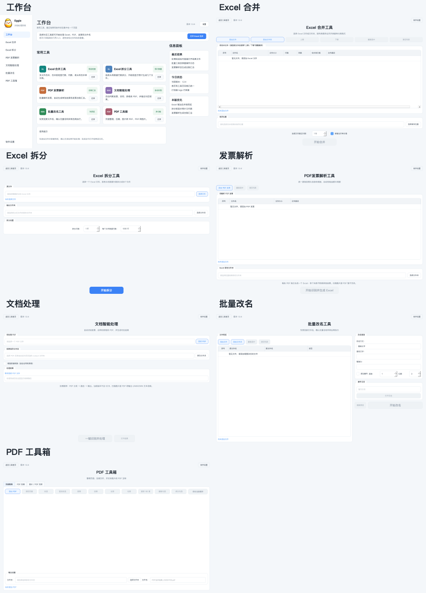

# Eggie DocuFlow / Eggie文档处理系统


Eggie DocuFlow 是一个面向日常办公场景的 Excel、PDF 与文件处理工具。当前版本支持
Excel 合并、Excel 拆分、文本型 PDF 发票结构化解析、PDF 文档智能处理、批量文件改名，以及 PDF 工具箱。

当前版本重点解决以下问题：

- 多个 Excel 文件批量合并
- 按文件列表顺序合并
- 尽量保留原始单元格格式、列宽、合并单元格和公式
- 按自定义数据行数拆分 Excel 文件
- 拆分文件自动保留指定表头
- 拆分结果自动集中保存到独立文件夹
- PDF 发票转换为财务结构化 Excel，并自动校验金额与税额
- PDF 文档智能路由：自动识别发票、合同、表格和未知文档
- 文档处理内可选接入用户自备的百度智能云或阿里云 OCR 密钥
- 可复制文字的 PDF 页仅在本机读取，仅扫描页在用户确认后调用云 OCR
- 可单独导出文字、保留页码与位置的 JSON 以及不包含密钥和正文的处理日志
- 合同 PDF 输出 Word 文档，表格 PDF 输出 Excel，未知 PDF 输出文本说明
- 文档智能处理支持增强排版转换，合同可套正式样式并还原附件表格，表格可保留边框和版式
- 批量改名工具支持先预览再执行，支持替换、删除、追加、改后缀、删除开头或结尾文字
- 改名预览出现空白文件名时会弹窗提醒并阻止执行
- PDF 工具箱支持缩略图拖拽排序、多选旋转、拆分、删除、压缩、图片转 PDF 和 PDF 转图片
- 文件和文件夹选择会记住上次打开位置
- 图片转 PDF 会自动过滤非图片或无法读取的文件
- 支持较大文件的低内存处理
- 提供简单易用的 macOS 与 Windows 图形界面

Eggie DocuFlow is a desktop utility for everyday office workflows. It supports
Excel merging, Excel splitting, structured parsing of text-based PDF invoices,
intelligent PDF document routing, batch file renaming, and PDF toolbox workflows.

The current release focuses on:

- Batch merging multiple Excel files
- Merging files in the order shown in the file list
- Preserving cell styles, column widths, merged cells, and formulas whenever possible
- Splitting Excel files by a custom number of data rows
- Keeping the configured header rows in every split file
- Saving split output files into an automatically created folder
- Converting PDF invoices into finance-ready Excel files with amount and tax validation
- Intelligent PDF routing for invoices, contracts, tables, and unknown documents
- Exporting contracts to Word, tables to Excel, and unknown PDFs to text reports
- Enhanced document layout conversion for formal contracts and table-like PDFs
- Batch file renaming with preview-first execution
- Safe warnings when a rename rule would create blank filenames
- PDF toolbox for thumbnail-based page ordering, multi-select rotation, split, delete, compression, images-to-PDF, and PDF-to-images
- File and folder dialogs remember the last used location
- Images-to-PDF skips unsupported or unreadable files automatically
- Low-memory processing for larger workbooks
- Simple and user-friendly macOS and Windows graphical interfaces

## 普通用户如何下载 / Download

如果你只是想直接使用软件，不需要安装 Python，也不需要运行源码。

1. 打开本项目右侧的 **Releases**
2. 下载最新版安装包
3. Mac：解压后运行 `EggieDocuFlow_V1.3.12_mac.app`
4. Windows：运行 `EggieDocuFlow_V1.3.12_Windows_x64_Setup.exe`，按安装向导完成安装后，从桌面或开始菜单打开软件
5. 本版本未做 Apple 公证；如果 macOS 阻止打开，请在 Finder 中右键 App，选择“打开”，再确认“打开”

If you only want to use the application, you do not need to install Python or
run the source code.

1. Open **Releases** on the right side of this repository
2. Download the latest application package
3. On macOS, extract the package and launch `EggieDocuFlow_V1.3.12_mac.app`
4. On Windows, run `EggieDocuFlow_V1.3.12_Windows_x64_Setup.exe`, then launch the app from the desktop or Start menu
5. This release is not Apple-notarized. If macOS blocks it, right-click the App in Finder, choose **Open**, then confirm **Open**

> Windows 版支持 Windows 10/11 64 位系统；安装程序默认安装到 `C:\Program Files\Eggie DocuFlow`，安装时会请求 Windows 管理员授权，并提供标准卸载入口。
> The Windows build supports 64-bit Windows 10/11. It installs to `C:\Program Files\Eggie DocuFlow` by default, requests Windows administrator approval during setup, and includes a standard uninstall entry.

## 软件界面 / Screenshots


### 统一后的工具页面 / Unified Tool Pages




## 主要功能 / Features

### Excel 合并 / Excel Merge

- 添加单个文件或递归添加整个文件夹 / Add individual files or recursively add an entire folder
- 通过“上移 / 下移”按钮调整合并顺序 / Reorder files with the **Move Up / Move Down** buttons
- 后续文件可跳过 `0-99` 行表头 / Skip `0-99` header rows in subsequent files
- 自动保留字体、填充、边框、对齐、数字格式和保护设置 / Preserve fonts, fills, borders, alignment, number formats, and protection settings
- 自动调整复制后的公式引用 / Adjust copied formula references automatically
- 可选择是否保留合并单元格 / Choose whether to preserve merged cells
- 保存窗口跟随 macOS 系统语言 / Use the macOS system language in the save dialog
- 普通工作簿使用低内存流式合并，复杂合并单元格自动切换兼容模式 / Use low-memory streaming for standard workbooks and compatibility mode for complex merged cells

### Excel 拆分 / Excel Split

- 新增 Excel 拆分工具 / Added a new Excel split tool
- 支持选择 Excel 文件进行拆分 / Users can select an Excel file to split
- 支持设置表头行数 / Users can configure the number of header rows
- 支持设置每个文件的数据行数 / Users can split an Excel file by a custom number of data rows
- 拆分行数不包含表头 / The split row count does not include header rows
- 每个拆分文件都会自动带上表头 / Each output file keeps the configured header rows
- 自动创建“原文件名_拆分结果”文件夹 / Output files are saved into an automatically created folder
- 拆分文件命名规则为“原文件名_拆分001.xlsx” / Split files are named like `原文件名_拆分001.xlsx`
- 优化了大文件拆分速度 / Large-file splitting performance has been improved
- 原始 Excel 文件只读取，不会被修改 / The original Excel file is read-only and will not be modified

### PDF发票解析工具 / PDF Invoice Parser

- 支持 100 页以内、可复制文字的 PDF 发票 / Supports text-based PDF invoices up to 100 pages
- 支持一次选择多个 PDF，每票独立生成 Excel / Supports multiple PDFs with one Excel output per invoice
- 单票失败不影响其他发票，并在完成后汇总失败原因 / A failed invoice does not stop the batch and is reported at completion
- 统一输出发票头信息、明细表和校验结果 / Outputs header, item, and validation sheets
- 校验数量与单价、金额与税额、价税合计 / Validates quantities, prices, amounts, taxes, and totals
- 不输出 PDF 原始逐行文本 / Never exports raw line-by-line PDF text

### 文档智能处理 / Document Intelligence

- 新增统一入口“文档智能处理” / Added a unified **Document Intelligence** entry
- 支持选择或拖拽 PDF 文件 / Supports selecting or dragging a PDF file
- 自动分类为发票、合同、表格或未知文档 / Automatically classifies invoices, contracts, tables, or unknown documents
- 发票复用原有发票解析逻辑并输出 Excel / Invoices reuse the existing invoice parser and export Excel
- 合同输出 Word 文档 / Contracts export Word documents
- 表格类 PDF 输出标准 Excel / Table-like PDFs export standard Excel workbooks
- 可勾选“增强排版转换”，由系统自动判断合同或表格后套用增强版式 / Users can enable enhanced layout conversion while the app still classifies the PDF automatically
- 合同增强模式会套正式合同样式，并尽量还原附件表格 / Enhanced contract conversion applies a formal contract style and restores attachment tables where possible
- 表格增强模式会尽量保留边框、列宽和行高 / Enhanced table conversion preserves borders, column widths, and row heights where possible
- 扫描件默认不启用 OCR，会输出 UNKNOWN 文本说明 / Scanned PDFs use the original UNKNOWN text result while cloud OCR is disabled
- 可在当前页面勾选“扫描页使用云 OCR”，使用用户自己申请的百度或阿里云密钥 / Optional user-supplied Baidu or Alibaba Cloud OCR credentials are integrated into the same page
- 不勾选云 OCR 时，原有处理流程不变 / The original document workflow remains unchanged when cloud OCR is disabled
- 可在同一页面点击“仅提取文字”，生成 TXT、JSON 和排查日志 / Text-only extraction creates TXT, JSON, and diagnostic log outputs

### PDF 工具箱 / PDF Toolbox

- 页面整理支持缩略图拖拽排序 / Page organizer supports thumbnail drag-and-drop ordering
- 支持多选页面后旋转、删除或拆分导出 / Supports multi-select page rotation, deletion, and split export
- 支持多个 PDF 合并，并可修改默认输出文件名 / Supports merging PDFs with editable output filenames
- 支持三档安全压缩 PDF，并显示预计压缩后大小和预计缩小比例 / Safely compresses PDFs with three presets and estimated size reduction
- 支持多张图片合成 PDF / Converts multiple images into one PDF
- 支持 PDF 每页导出 PNG 或 JPG 图片 / Exports each PDF page as PNG or JPG images
- 图片转 PDF 支持缩略图预览、拖拽排序、双击放大和自动过滤非图片文件 / Images-to-PDF supports thumbnail preview, drag ordering, double-click preview, and automatic non-image filtering

## 使用方法 / Usage

1. 从桌面、开始菜单或 Mac 应用程序中打开 Eggie DocuFlow。 / Launch Eggie DocuFlow from the desktop, Start menu, or macOS Applications.
2. 选择需要使用的工具。 / Choose the tool you need.

合并 Excel：

1. 添加 Excel 文件或包含 Excel 文件的文件夹。 / Add Excel files or a folder containing Excel files.
2. 使用“上移 / 下移”确认文件顺序。 / Confirm the merge order with **Move Up / Move Down**.
3. 设置后续文件跳过的行数。 / Set the number of rows to skip in subsequent files.
4. 选择输出文件位置并点击“开始合并”。 / Choose an output location and click **Start Merge**.

拆分 Excel：

1. 选择一个 `.xlsx` Excel 文件。 / Select one `.xlsx` Excel file.
2. 设置表头行数。 / Configure the number of header rows.
3. 设置每个文件的数据行数。 / Configure the number of data rows per output file.
4. 选择输出位置并点击“开始拆分”。 / Choose an output location and click **Start Split**.
5. 程序会自动创建“原文件名_拆分结果”文件夹并保存全部拆分文件。 / The app automatically creates an output folder and saves all split files there.

解析 PDF 发票：

1. 选择一个或多个文本型 PDF 发票。 / Select one or more text-based PDF invoices.
2. 选择 Excel 保存文件夹并点击“开始识别并生成 Excel”。 / Choose an output folder and start parsing.
3. 每张发票会生成独立 Excel；完成后查看成功、失败及校验结果。 / Each invoice gets its own Excel file; review the completion summary and validation results.

文档智能处理：

1. 进入“文档智能处理”。 / Open **Document Intelligence**.
2. 选择或拖拽一个 PDF 文件。 / Select or drag one PDF file.
3. 点击“一键识别并处理”。 / Click **Identify and Process**.
4. 查看识别类型、状态和输出文件路径。 / Review the detected type, status, and output path.
5. 如需识别扫描件，先在软件“设置 → 第三方服务”中配置自己的 OCR 密钥，再回到文档处理页面选择平台并勾选“扫描页使用云 OCR”。 / For scanned pages, configure your own OCR credentials under **Settings → Third-party Services**, then return to Document Processing and enable cloud OCR.
6. 只需要文字时，点击“仅提取文字”。 / Use **Extract Text Only** when no document conversion is needed.

OCR 的注册、密钥、数据流向、费用和法律责任说明请阅读 [OCR 使用说明](docs/OCR使用说明.pdf)。

批量改名：

1. 进入“批量改名工具”。 / Open **Batch Rename**.
2. 添加文件或文件夹。 / Add files or a folder.
3. 选择改名方式并先查看预览。 / Choose a rename rule and review the preview first.
4. 确认无重名、无空白文件名后点击“开始改名”。 / Start renaming only after confirming there are no duplicates or blank filenames.

PDF 工具箱：

1. 进入“PDF 工具箱”。 / Open **PDF Toolbox**.
2. 在“页面整理”中添加 PDF，拖动缩略图调整顺序，可多选页面旋转、拆分或删除。 / Add PDFs in **Page Organizer**, drag thumbnails to reorder, and multi-select pages to rotate, split, or delete.
3. 在“PDF 压缩”中选择压缩档位，查看预计体积后生成压缩结果。 / Use **PDF Compression** to pick a preset, review the estimated size, and create a compressed copy.
4. 在“图片 / PDF 互转”中添加图片或文件夹，拖动缩略图排序后合成 PDF，也可以把 PDF 导出为 JPG 或 PNG。 / Use **Image / PDF Conversion** to add images or folders, reorder thumbnails, build PDFs, or export PDF pages as JPG or PNG.

## 使用说明与注意事项 / Notes

- 建议合并前关闭正在打开的 Excel 文件。 / Close any open Excel files before merging.
- 建议合并前先备份原始文件。 / Back up the original files before merging.
- 当前优先支持 `.xlsx` 和 `.xlsm` 文件。 / `.xlsx` and `.xlsm` files are currently the primary supported formats.
- Excel 拆分工具当前仅支持 `.xlsx` 文件。 / The Excel split tool currently supports `.xlsx` files only.
- PDF 发票解析工具仅支持文本型、单票 PDF，扫描件请先转为可复制文字的 PDF。 / The PDF invoice parser supports one text-based invoice per PDF; scanned PDFs are not supported.
- 文档智能处理默认不调用云 OCR；用户主动勾选、配置密钥并在发送前确认后，才会上传扫描页。 / Cloud OCR is off by default and scanned pages are sent only after explicit user configuration and confirmation.
- OCR 密钥保存在当前 Mac 用户的个人配置区 `.env` 文件中，该文件已被 Git 忽略，禁止上传或分享。 / OCR credentials are stored in a per-user local `.env` file that is ignored by Git and must never be shared.
- 批量改名工具会先预览新文件名，空白、重名或目标已存在时不会执行。 / Batch Rename previews first and blocks blank names, duplicates, and existing targets.
- PDF 工具箱只生成新文件或新文件夹，不会覆盖原 PDF。 / PDF Toolbox creates new files or folders and does not overwrite the source PDF.
- 图片转 PDF 当前支持 JPG、JPEG、PNG、BMP、TIF、TIFF 和 WEBP。 / Images-to-PDF currently supports JPG, JPEG, PNG, BMP, TIF, TIFF, and WEBP.
- 拆分工具只读取原始 Excel 文件，不会修改原文件。 / The split tool only reads the original Excel file and will not modify it.
- 加密、损坏、受保护的 Excel 文件可能无法正常合并。 / Encrypted, corrupted, or protected workbooks may not merge correctly.
- 合并大文件时请耐心等待。 / Large workbooks may require additional processing time.
- 如果合并结果异常，请先检查源文件格式是否一致。 / If the result looks incorrect, first check whether the source files use consistent structures and formats.
- 本版本未做 Apple 公证；首次打开被拦截时，请右键 App 并选择“打开”。 / This release is not Apple-notarized. If first launch is blocked, right-click the App and choose **Open**.

## 本地运行 / Run from Source

开发者可以使用以下命令从源码运行。普通用户无需执行这些步骤。

Developers can run the project from source with the commands below. Regular
users do not need to follow these steps.

```bash
python3 -m venv .venv
source .venv/bin/activate
python -m pip install -r requirements.txt
python main.py
```

## 测试 / Tests

```bash
python -m unittest discover -s tests -v
```

性能基准 / Performance benchmark:

```bash
python scripts/benchmark.py /path/to/excel-folder
```

## macOS 构建 / Build for macOS

当前正式构建仅支持 Apple 芯片 Mac。

The current release build supports Apple Silicon Macs only.

```bash
PYTHON=.venv/bin/python scripts/build_macos.sh
```

构建结果位于 `release/`，正式版文件名为：

- `EggieDocuFlow_V1.3.12_mac.app`
- `EggieDocuFlow_V1.3.12_mac.zip`

打包脚本保留所有 `qtbase` 系统语言翻译，并移除本工具不使用的 Qt 网络、TLS、
SVG 和图片插件。

Build artifacts are written to `release/`. The packaging script keeps all
`qtbase` system-language translations and removes unused Qt network, TLS, SVG,
and image plugins.

## Windows 构建 / Build for Windows

Windows 正式版应在 Windows 10/11 64 位环境构建，并使用 Inno Setup 生成安装向导。安装包采用现代安装界面，显示软件图标、默认安装位置、桌面快捷方式选项、安装进度和“立即打开”选项。

```powershell
powershell -ExecutionPolicy Bypass -File scripts\\build_windows.ps1
```

构建完成后，`release/` 中会生成：

- `EggieDocuFlow_V1.3.12_Windows_x64_Setup.exe`

安装完成后请在真实 Windows 环境中打开软件，并用 Microsoft Excel 实际打开软件生成的 Excel 文件；出现损坏或修复提示时不得交付该安装包。

## 版本记录 / Changelog

### V1.3.12

- 修复 Windows 发票读取任务意外结束后界面无法恢复的问题；异常时会明确提示，不会一直停在处理中 / Fixed recovery after an unexpected end of the Windows invoice-reading task; the app now clearly reports the exception instead of remaining in processing state
- 多页发票会显示实际读取页数进度；不会因页数而自动停止 / Multi-page invoices now show real page-reading progress and never stop automatically based on page count
- 台账 Excel 已生成但处理日志未生成时，会保留台账并单独说明日志问题，避免误报台账生成失败 / If the ledger Excel is created but its processing log is not, the ledger is retained and the log issue is reported separately

### V1.3.11

- 修复销售方名称被错误拼接明细表文字的问题；销售方信息在明细表开始处停止读取 / Fixed seller names incorrectly absorbing item-table text; seller fields now stop at the beginning of the item table

### V1.3.10

- 修复 Windows 多页专票读取时买卖双方信息丢失、明细行不完整和校验异常的问题；Windows 与 Mac 统一使用保留发票版面位置的读取方式，不再自动中断 / Fixed missing party details, incomplete item rows, and validation errors when Windows reads multi-page VAT invoices; both platforms now preserve the invoice layout and never stop automatically

### V1.3.9

- Windows 发票解析不再因固定等待时间中断；只有用户点击“强制结束当前任务”才会停止 / Windows invoice parsing no longer stops after a fixed wait; it stops only when the user chooses Force Stop
- Mac 发票读取保持原有稳定方式，不受 Windows 专项处理影响 / macOS invoice parsing keeps its established stable behavior and is unaffected by the Windows-specific change

### V1.3.8

- 发票读取改为可安全停止的独立任务，并提供“强制结束当前任务”按钮 / Invoice parsing can now be safely stopped and provides a force-stop button
- 发票、文档导出和批量改名兼容 Windows 共享盘不支持硬链接的情况 / Invoice, document export, and batch rename now handle Windows shared folders that reject hard links
- Windows 安装包默认安装到 `C:\Program Files\Eggie DocuFlow`，安装时请求管理员授权 / The Windows installer now defaults to `C:\Program Files\Eggie DocuFlow` and requests administrator approval

### V1.3.7

- 修复部分有效 Excel 文件缺少内部表格尺寸信息时，Excel 合并无法开始的问题 / Fixed Excel merge for valid workbooks that omit internal sheet-size information

### V1.3.6

- PDF 转图片支持同时添加多个 PDF 或文件夹，并提升默认清晰度 / Added multi-PDF and folder import with higher-resolution image export
- 单页 PDF 直接生成图片，多页 PDF 按原文件名建立文件夹并顺序命名 / Saved single-page PDFs directly and grouped multi-page outputs with ordered names
- 图片、PDF 页面和批量改名增加当前数量、数量保护和拆分任务提示 / Added visible counts, safety limits, and batch-splitting guidance
- 大文件和多文件处理增加全局进度提示，预览采用缓存减少界面卡顿 / Added global progress feedback and cached previews for large jobs
- 批量改名的规则预览改为延迟刷新，并阻止使用过期预览执行 / Debounced rename previews and blocked execution with stale results
- 文档处理支持百度和阿里云 OCR，两个平台的密钥可分别保存并切换 / Added Baidu and Alibaba Cloud OCR with separately saved provider credentials
- OCR 文字结果改为全部生成成功后再保留，失败时不留下半成品 / Prevented incomplete OCR result bundles after failures
- 优化 PDF 工具箱、页面整理和主页按钮布局 / Refined PDF toolbox, page organizer, and home-page button layouts

### V1.3.5

- 主界面改为更朴素、清晰的浅色科技风 / Refined the home page with a simpler light technology style
- 左侧菜单在全部功能页面持续显示 / Kept the sidebar visible across every tool page
- 删除首页重复的“打开 Excel 合并”按钮和虚假信息面板 / Removed the duplicate Excel shortcut and placeholder information panels
- 统一全部功能页的标题、按钮、卡片和输入区域 / Unified headings, buttons, cards, and input areas across all tools
- 加粗并放大数字输入框的上下箭头 / Enlarged and sharpened numeric input arrows
- 发票结果按发票号码命名，并补充销售方名称和税号日志 / Named invoice outputs by invoice number and added seller fields to logs
- 修复真实 PDF 内容流压缩失败的问题 / Fixed PDF compression for files with existing content streams
- 统一软件名称、版本号和 macOS 显示名称 / Unified product naming and version metadata

### V1.3.4

- 首页改为左侧导航、常用工具卡片和右侧信息面板 / Redesigned the home page with sidebar navigation, tool cards, and an information panel
- 统一首页和所有工具页的浅色界面风格 / Unified the light workspace style across the home page and all tool pages
- 统一按钮、输入框、表格、卡片边框和页面底色 / Unified buttons, inputs, tables, card borders, and page backgrounds
- Excel 合并增加合并前预览，显示行数、列数和合并单元格数量 / Added pre-merge preview for rows, columns, and merged-cell count
- Excel 拆分增加预计生成文件数量提示 / Added estimated output file count before Excel splitting
- PDF 发票解析新增发票台账汇总和汇总日志 / Added invoice ledger summary and ledger logs
- 修复打包版首页左上角 logo 不显示的问题 / Fixed the missing logo in the packaged app home page
- 保存整套页面截图作为后续 UI 调整参考 / Saved full-page UI screenshots for future design iteration

### V1.3.3

- 新增 PDF 工具箱 / Added PDF Toolbox
- 页面整理支持缩略图拖拽排序、多选旋转、删除和拆分 / Added thumbnail ordering, multi-select rotation, deletion, and split export
- 多 PDF 合并支持默认文件名并允许手动修改 / Added editable output filename for merged PDFs
- 新增 PDF 安全压缩，并显示压缩前后大小 / Added safe PDF compression with before/after size reporting
- 新增图片转 PDF 和 PDF 转图片 / Added images-to-PDF and PDF-to-images conversion
- 图片转 PDF 支持缩略图、拖拽排序、双击放大和文件夹导入 / Added thumbnail preview, drag ordering, double-click preview, and folder import for images-to-PDF
- PDF 压缩新增三档选择、预计压缩后体积和预计缩小比例 / Added three compression presets with estimated output size and reduction percentage
- 添加文件和文件夹会记住上次打开位置 / File and folder dialogs now remember the last used location
- 图片转 PDF 自动过滤非图片和无法读取文件 / Images-to-PDF now filters non-image and unreadable files automatically
- 优化缩略图布局，避免图片和文字重叠 / Improved thumbnail layout to prevent overlap
- PDF 工具操作会生成 txt 日志 / Added txt logs for PDF toolbox operations
- 批量 PDF 处理默认同时处理 2 个文件 / Batch PDF processing now handles 2 files at once by default
- 批量处理日志记录每个文件的开始、成功、失败原因和输出位置 / Batch logs now record each file's start, success, failure reason, and output path
- 并发输出时自动保护同名结果文件，避免互相覆盖 / Concurrent output now protects duplicate result filenames from collisions
- 优化正式合同增强排版的跨页文字合并和表格续接 / Improved formal contract layout conversion for cross-page text and continued tables

### V1.3.2

- 新增批量改名工具 / Added Batch Rename
- 支持替换、删除、前后追加、修改后缀、删除开头或结尾指定数量文字 / Added replace, delete, prefix, suffix, extension, and trim-start-or-end rename rules
- 批量改名前会先预览，空白、重名或目标已存在时阻止执行 / Added preview-first safety checks for blank names, duplicates, and existing targets
- 改名完成后生成 txt 操作日志 / Added txt operation logs after renaming
- 优化批量改名界面为左右分区 / Improved Batch Rename layout with a clearer left-right split

### V1.3.1

- 文档智能处理新增“增强排版转换”选项 / Added enhanced layout conversion in Document Intelligence
- 合同增强模式套用正式合同样式，并支持附件表格还原 / Enhanced contract conversion applies a formal contract style and restores attachment tables
- 表格增强模式尽量保留边框、列宽和行高 / Enhanced table conversion preserves table borders, column widths, and row heights
- 软件界面显示当前版本号 / Added visible app version labels
- 新增 v2 扩展层和自动化测试，不改动 v1 核心路由 / Added a v2 extension layer and tests without changing the v1 core router

### V1.3.0

- 文档智能路由系统上线 / Added the document intelligence routing system
- 支持发票、合同、表格和未知文档自动分类 / Added automatic classification for invoices, contracts, tables, or unknown documents
- App 入口新增“文档智能处理”，支持文件选择和拖拽 PDF / Added the Document Intelligence app entry with file selection and PDF drag-and-drop
- 完成 core / parsers / exporters / utils 模块化架构 / Completed the core / parsers / exporters / utils modular architecture
- 新增统一版本标识和日志版本号 / Added unified version metadata and versioned logs
- 完成真实 PDF 验证 / Completed real PDF validation

### V1.2.1

- 支持批量选择 PDF 发票，每票独立生成 Excel / Added batch PDF selection with one Excel file per invoice
- 单票失败不影响其他任务，完成后统一提示失败原因 / Isolated per-invoice failures and added a completion summary
- 自动避免覆盖同名结果文件 / Prevented overwriting output files with duplicate names

### V1.2.0

- 新增 PDF发票解析工具 / Added the PDF invoice parser
- 输出发票头信息、明细表和校验结果 / Added structured header, item, and validation sheets
- 新增金额、税额与价税合计校验 / Added amount, tax, and total validation
- 修复免税行、跨行字段和长项目名称的解析 / Fixed tax-exempt rows, wrapped fields, and long item names
- 防止未确认覆盖已有 Excel 文件 / Prevented unconfirmed overwrites of existing Excel files
- 扫描件和多票 PDF 会明确提示，不生成错账文件 / Scanned and multi-invoice PDFs are rejected safely

### V1.1.1

- 精简界面代码并改用系统原生控件 / Simplified the UI and adopted native system controls.
- 防止输出路径别名覆盖源 Excel 文件 / Prevented output path aliases from overwriting source workbooks.
- 合并结果采用安全的临时文件写入 / Added atomic saves to preserve existing output when a merge fails.
- 拆分前检测跨边界合并单元格，避免静默丢失内容 / Detect merged cells across split boundaries to prevent silent data loss.
- 拆分失败时自动清理本次残缺结果 / Remove incomplete split output created by a failed run.
- 新增相关自动化测试 / Added regression tests for the new safeguards.

### V1.1.0

- 新增 Excel 拆分工具 / Added Excel split tool.
- 支持自定义表头行数 / Added support for custom header row count.
- 支持自定义每个文件的数据行数 / Added support for custom data rows per output file.
- 每个拆分文件自动保留表头 / Each split file keeps the configured header rows.
- 自动创建拆分结果文件夹 / Added automatic output subfolder creation.
- 优化拆分文件命名规则 / Improved split file naming.
- 优化大文件拆分速度 / Improved large Excel file split performance.
- 原始 Excel 文件只读取、不修改 / Original Excel file is read-only and will not be modified.

### V1.0.1

- 优化大文件合并速度并显著降低内存占用 / Improved large-file merge speed and significantly reduced memory usage
- 使用轻量 XLSX 元数据扫描加快文件信息读取 / Added lightweight XLSX metadata scanning for faster file inspection
- 自动选择流式模式或合并单元格兼容模式 / Automatically selects streaming or merged-cell compatibility mode
- 缓存重复单元格样式 / Caches repeated cell styles
- 精简 macOS 应用体积 / Reduced the macOS application size

### V1.0.0

- 首个正式版本 / Initial public release
- 支持文件、文件夹、排序、保存路径和格式保留 / Added file and folder selection, ordering, output paths, and formatting preservation

## 许可证

本项目采用 MIT License 开源协议。

你可以自由使用、复制、修改和分发本项目，但请保留原始版权和作者信息。

请勿将本项目重新包装后冒充原创，或用于误导性传播。

## License

This project is licensed under the MIT License.

You are free to use, copy, modify, and distribute this project, but please retain the original copyright and author information.

Please do not repackage this project as your own original work or use it for misleading distribution.
